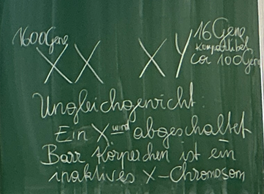

> # 06 BARR-KÖRPERCHEN

---

* Murray Barr 1908–1955
* stark färbbare Bereiche an der Innenseite der Kernmembran

Weiblich (♀): haben Barr-Körperchen
(Anzahl der X-Chromosomen minus 1)

Männlich (♂): haben keines

-> Test bei Sportlern!

**LYON HYPOTHESE**
Ein X-Chromosom → abgeschaltet
X‑chromosomales Mosaik

---

